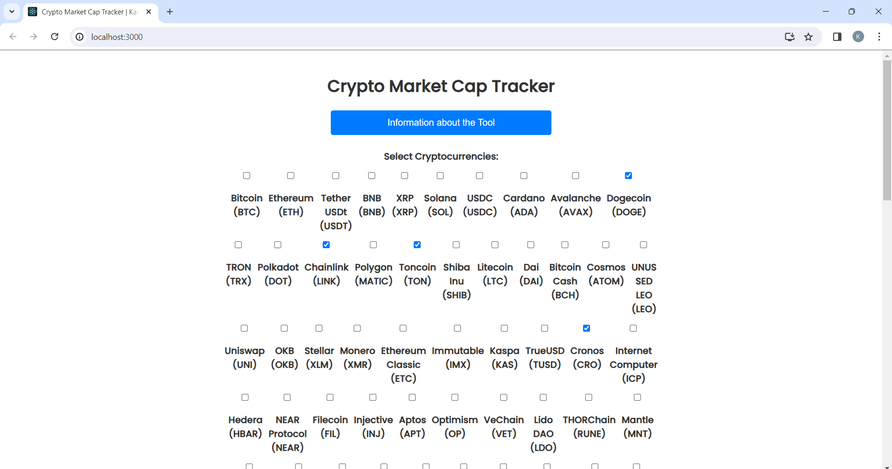
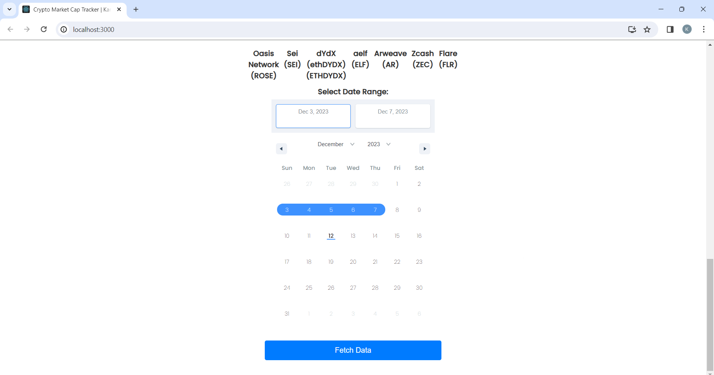

# Crypto Market Cap Tracker

This is a web application for tracking and downloading market cap data of cryptocurrencies. The application allows users to select specific cryptocurrencies, choose a date range, and fetch the corresponding market cap data from the CoinMarketCap API. The fetched data is then saved as JSON and downloaded as txt file.


## Table of Contents

- [Structure](#structure)
- [Technologies](#technologiesused)
- [Screenshots](#screenshots)
- [Features](#features)
- [Getting Started](#getting-started)
  - [Prerequisites](#prerequisites)
  - [Installation](#installation)
- [Usage](#usage)

## Structure
- your root folder where node will be installed 
1. crypto-marketcap-frontend
2. crypto-marketcap-backend

## Technologies Used
1. React js
2. Express js (Nodejs Framework)
3. Axios and CORS middleware are also used
4. 
## Screenshots



## Features

- Select and deselect cryptocurrencies for data retrieval.
- Choose a specific date range for the market cap data.
- Fetch data from the CoinMarketCap API.
- Download the fetched data as a JSON file.

## Getting Started

### Prerequisites

Before running the application, make sure you have the following installed:

- [Node.js](https://nodejs.org/)
- [npm](https://www.npmjs.com/) (Node Package Manager)

### Installation

1. Clone the repository:

   ```bash
   git clone https://github.com/your-username/crypto-market-cap-tracker.git
   ```

2. Navigate to the project directory:

   ```bash
   cd crypto-marketcap
   ```

3. Install the dependencies:

   ```bash
   npm install
   ```

## Usage

1. Start the frontend application:

   ```bash
   cd crypto-marketcap-frontend
   npm start
   ```

   This will start the React development server, and you can access the application in your web browser at [http://localhost:3000](http://localhost:3000).

2. Start the backend server:

   ```bash
   cd cd crypto-marketcap-backend
   node index.js
   ```

   The backend server will run at [http://localhost:3001](http://localhost:3001).

3. Follow the instructions on the web application to select cryptocurrencies, choose a date range, and fetch data.
